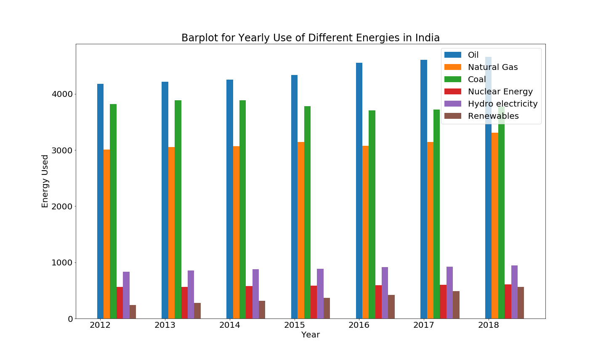

# Research Method (DS200)

## Software used
1. Python 3
2. pandas, numpy, matplotlib.

## Datasets Used 
The datasets are  available publicly at <https://data.gov.in>.The Energy_data.xls tells about the energy used from 2012 to 2018 across India.Rain_data.xls describes yearly rainfall in north-west region in the month of June,July,August,September from 1901 to 2016 

**a Bar Plot**

**Observation:**
The use of renewable energy increases over years due to more focus on clean energy.The Use of coal,hydroelectricity and nuclearenergy remain constant.The use of natural gas varies over the years and no trends observed.The use of oil increases mostly due to increase in number of vehicles.

**b. Box Plot**

**Observation:** 
The highest to lowest rainfall in that region occurs in the month of August,July,September,June in Order.The rainfall in July and August is much higher than June and September.  
**c. Scatter Plot**

**Observation:** The consistency in amount of rainfall over the years in month of June and September is more than that of July and August as in case of July and August points are more scattered than that of June and September. 

## References

1. https://data.gov.in
2. https://matplotlib.org/

